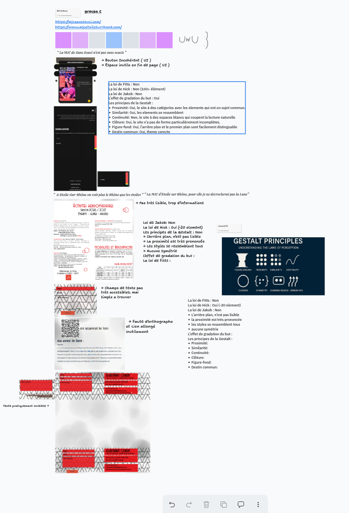
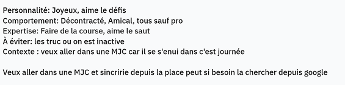
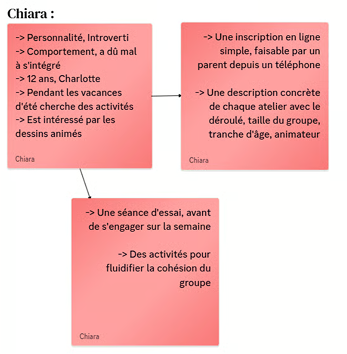
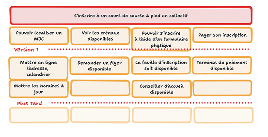
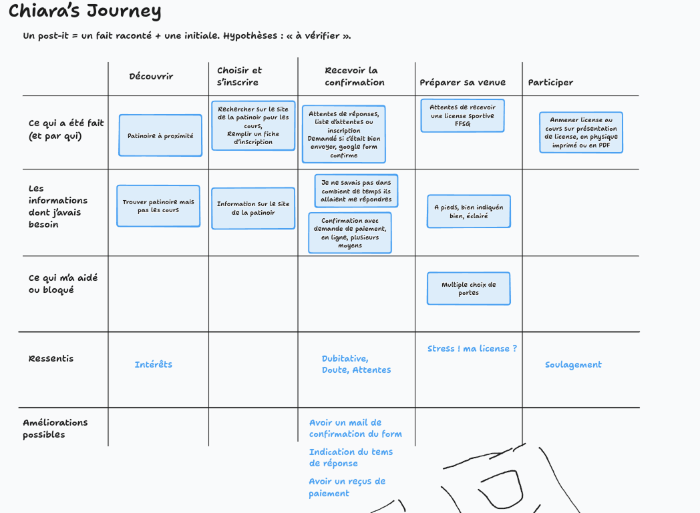
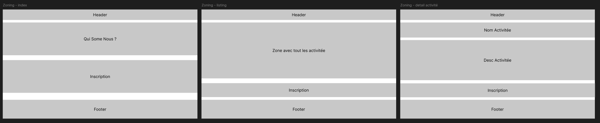
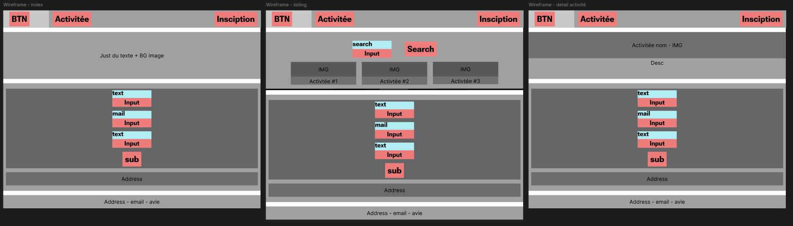
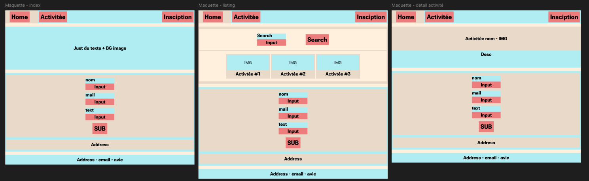
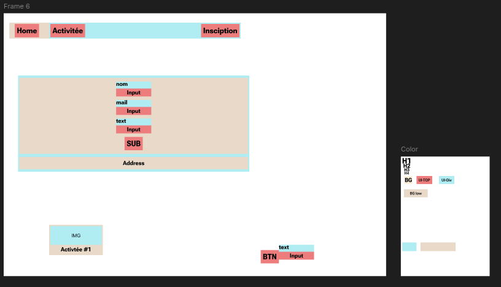
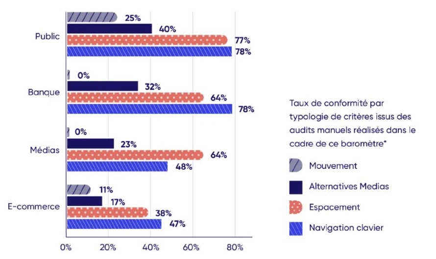

# Compte rendu : UX, UI et accessibilité

## Jour 1 - UX et UI

Nous avons découvert les lois de l’UX et de l’UI, ainsi que plusieurs règles à prendre en compte lors de la conception d’une interface.

### Les lois étudiées

Plus une cible est grande et proche du pointeur, plus on l’atteint vite.

Dans une interface :

- Les boutons importants sont grands et faciles à atteindre.
- Deux boutons trop proches augmentent le risque d’erreur.
- Sur téléphone, chaque cible doit être assez grande pour un doigt.

Paul Fitts a publié sa formule en 1954 : $T = a + b \times \log_2(2D / L)$. $T$ est le temps pour atteindre la cible, $D$ la distance, $L$ la largeur de la cible. $a$ et $b$ dépendent du pointeur : souris, doigt ou pavé tactile.

[Fiche Laws of UX : loi de Fitts](https://lawsofux.com/fr/loi-de-fitts/)

Le temps de décision augmente avec le nombre et la complexité des choix.

Dans une interface :

- Les options d’un formulaire sont regroupées par sujet.
- Un menu garde peu d’entrées, rangées en groupes.
- Une longue liste a une recherche ou des filtres.

[Fiche Laws of UX : loi de Hick](https://lawsofux.com/fr/loi-de-hick/)

Les gens passent la plupart de leur temps sur d’autres sites que le vôtre. Ils s’attendent à ce que votre site marche comme ceux qu’ils connaissent déjà.

Dans une interface :

- Le logo en haut à gauche ramène à l’accueil.
- Le panier est en haut à droite.
- Un texte souligné dans un paragraphe est un lien.

Si vous changez une convention, vérifiez que les utilisateurs comprennent la nouvelle interface.

[Fiche Laws of UX : loi de Jakob](https://lawsofux.com/fr/loi-de-jakob/)

Plus on se rapproche d’un but, plus on fait d’efforts pour l’atteindre. En anglais, on parle de *goal-gradient effect*.

Dans une interface :

- Une barre de progression montre ce qui reste à faire, par exemple « Étape 2 sur 3 ».
- Un long formulaire est découpé en étapes, et chaque étape terminée fait avancer la barre.
- Un avantage réel déjà obtenu apparaît dès le départ, comme deux tampons offerts sur une carte de fidélité.

En 2006, les chercheurs Joseph Nunes et Xavier Drèze ont distribué des cartes de fidélité dans une station de lavage. La première carte demandait 8 tampons. La seconde en demandait 10, dont 2 déjà offerts. Il fallait donc 8 lavages dans les deux cas. 19 % des clients ont rempli la première carte, et 34 % la seconde.

La progression affichée doit correspondre aux étapes restantes. Une barre trompeuse conçue pour retenir l’utilisateur est un dark pattern.

[Fiche Laws of UX : effet de gradation du but](https://lawsofux.com/fr/effet-de-gradation-du-but/)

Au début du XXe siècle, des psychologues ont étudié comment nous regroupons les formes que nous voyons. Leurs principes, dits de la Gestalt (*forme* en allemand), aident à organiser un écran.

| Principe | Ce qu’il dit | Un exemple |
| --- | --- | --- |
| Proximité | Des éléments proches semblent aller ensemble. | Sur Netflix, le titre d’une rangée est collé à ses films. |
| Similarité | Des éléments qui se ressemblent semblent avoir le même rôle. | Sur GitHub, les labels ont tous la même forme, et chaque statut a sa couleur. |
| Continuité | L’œil suit les lignes et les alignements, même interrompus. | Le chemin de progression de Duolingo ou la barre d’étapes d’un formulaire. |
| Clôture | Le cerveau complète une forme incomplète. | Le panda du logo du WWF n’a pas de contour complet, et on le voit quand même. |
| Figure-fond | On sépare ce qui est devant de ce qui est derrière. | Une modale de connexion au-dessus d’une page assombrie. |
| Destin commun | Des éléments qui bougent ensemble semblent aller ensemble. | Les films d’un carrousel qui défilent ensemble. |

### Audit de sites web

Nous avons réalisé un audit de deux sites web afin d’identifier les règles qu’ils ne respectaient pas.

### Personas

Nous avons créé des personas afin d’imaginer une meilleure alternative aux sites web de la MJC.

### User stories

Nous avons ensuite rédigé des user stories pour nos personas.

### Parcours utilisateur

Nous avons réalisé un parcours utilisateur à partir de mon propre cas.

### Sitemap

Nous avons terminé cette journée par la création des sitemaps.

## Jour 2 - UI et UX avec Figma

### Projet Figma

[Voir le projet Figma](https://www.figma.com/design/H8E0yG6R39Z7tzDPkgClOt/Matteo?node-id=0-1&p=f&t=Fq019D57KfK67Sf3-0)

### Zoning et wireframes

Nous avons étudié le zoning et les wireframes, puis conçu trois pages pour notre alternative de site de la MJC.

Nous avons ensuite travaillé sur les wireframes. Certaines couleurs sont visibles, car nous avons également étudié les composants dans Figma.

### Maquette

Nous avons créé la maquette en ajoutant des couleurs au wireframe.

### Design system et token system

En complément, nous avons découvert les design systems et les token systems : typographie, couleurs, graphiques et formes.

### Prototypes Figma

Nous avons découvert les prototypes dans Figma.

## Jour 3 - Accessibilité et HTML

Nous avons étudié l’accessibilité, le HTML et des référentiels comme le RGAA, basé sur les recommandations internationales WCAG.

Nous avons également appris que 69 % des sites publics ne sont pas accessibles.

### Outils d’audit

- **WAVE** (*Web Accessibility Evaluation Tools*) permet d’analyser l’accessibilité d’un site.
- **Lighthouse** permet de réaliser un audit d’accessibilité.
- **Access42** propose des conseils et des formations sur l’accessibilité numérique.

### HTML et ARIA

- **A11Y** est l’abréviation d’*Accessibility*.
- **ARIA** (*Accessible Rich Internet Applications*) améliore l’accessibilité des applications web riches.
- L’attribut `aria-label` permet de donner un nom accessible à un élément. Cependant, il faut privilégier l’élément HTML `<label>` lorsque c’est possible.
- Le HTML sémantique facilite la compréhension de la structure d’une page.
- Les composants accessibles comprennent notamment `
`, `<dialog>` et `<datalist>`.

### Bonnes pratiques

- Vérifier le contraste des couleurs.
- Ajouter un texte alternatif pertinent avec `alt` pour les images informatives.
- Utiliser `alt=""` pour les images décoratives.
- Éviter d’utiliser des `
` lorsque des éléments HTML sémantiques sont disponibles.
- Ajouter des liens d’évitement (*skip links*) pour accéder directement à une section du site.

### Déclaration et chiffres clés

- Une déclaration d’accessibilité indique le niveau de conformité d’un site.
- Une fiche utilisateur descriptive d’une personne fictive permet de mieux comprendre les besoins des utilisateurs.
- Environ 1,3 milliard de personnes vivent avec un handicap dans le monde.
- D’après les notes présentées, 96 % des sites ne sont pas accessibles.
- Une amende maximale de 50 000 € est mentionnée pour un site non accessible.

### Audit d’accessibilité

Nous avons réalisé des audits d’accessibilité afin de vérifier si un site web est accessible.

[Voir mon audit d’accessibilité](https://github.com/Psyko38/Audit-d-accessibilite)